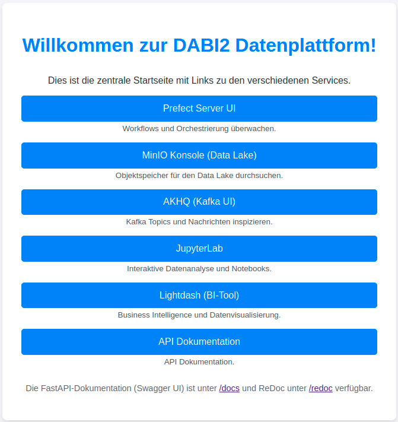

# Projekt DABI2

Dieses Projekt implementiert eine Daten-Streaming- und Verarbeitungsplattform, die Change Data Capture (CDC) aus einer OLTP-Datenbank nutzt, Daten über Kafka streamt, in einem Data Lake (MinIO) ablegt, mit dbt und Prefect in einem DuckDB Data Warehouse transformiert und Analysen sowie Orchestrierung mit JupyterLab ermöglicht. Ein Caddy-Server fungiert als Reverse Proxy für die verschiedenen Web-UIs.

Die Übersichtsseite ***http://localhost:3001*** bietet eine Linksammlung zu allen Tools auf die zugegriffen werden kann über den Browser

## Inhaltsverzeichnis

1.  [Überblick](#überblick)
2.  [Architektur](#architektur)
3.  [Features](#features)

## Überblick

Dieses Projekt dient als End-to-End-Beispiel für eine Datenplattform, die folgende Kernaufgaben abdeckt:
* **Change Data Capture (CDC):** Änderungen aus einer PostgreSQL-Datenbank (OLTP) werden in Echtzeit erfasst.
* **Streaming:** Die erfassten Änderungen werden über einen Kafka-Message-Broker gestreamt.
* **Data Lake Ingestion:** Ein Python-Consumer liest die CDC-Events von Kafka und schreibt sie als Parquet-Dateien in einen MinIO Data Lake.
* **Data Warehousing:** dbt transformiert die Rohdaten aus dem Data Lake (oder direkt aus der OLTP-Quelle via Staging/Seeds) und baut ein analytisches Data Warehouse in ClickHouse auf.
* **Workflow Orchestrierung:** Prefect wird verwendet, um die verschiedenen Datenpipelines (z.B. dbt-Läufe, Consumer-Starts) zu orchestrieren und zu überwachen.

## Architektur

### data flow
***Data Flow Chart***

### OLTP 
***ERM Diagram OLTP***

### dbt
***DBT lineage graph***

### Dwh
***Star Schema***

## Features

* **Echtzeit-CDC:** Nutzung von Debezium für PostgreSQL.
* **Skalierbares Streaming:** Apache Kafka als Message Broker.
* **Effiziente Speicherung im Data Lake:** MinIO mit Parquet-Dateiformat.
* **Modernes Data Warehousing:** ClickHouse.
* **Transformationslogik mit dbt:** Code-basierte, versionierbare und testbare Datenmodelle.
* **Flexible Workflow-Orchestrierung:** Prefect für die Steuerung und Überwachung von Datenpipelines.
* **Benutzerfreundliche UIs:** AKHQ für Kafka-Monitoring, MinIO-Konsole, Prefect-UI, JupyterLab.
* **Entwicklerfreundlich:** Docker-Compose-Setup mit Hot-Reloading für einige Services.
* **Makefile-Automatisierung:** Vereinfachte Befehle für Setup, Start und Stopp.
