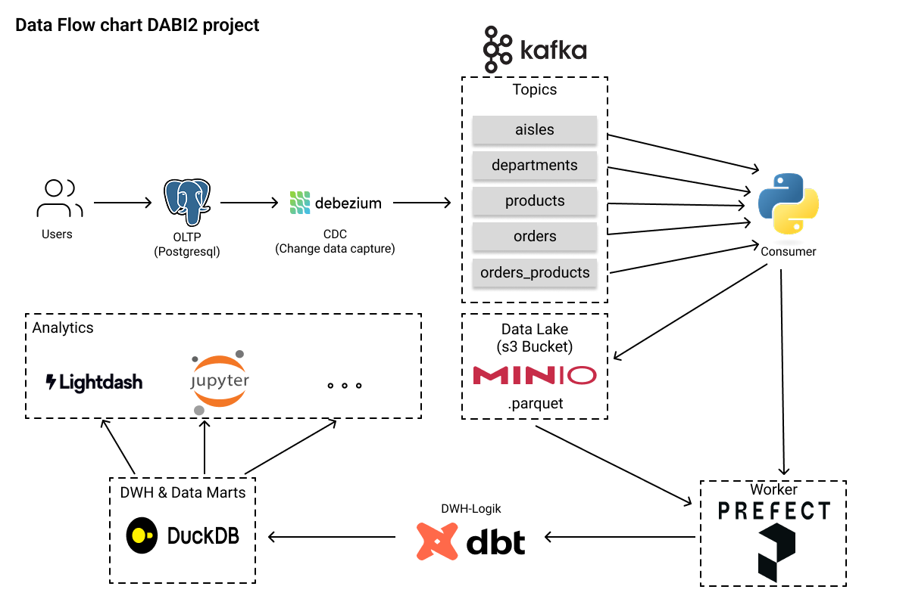
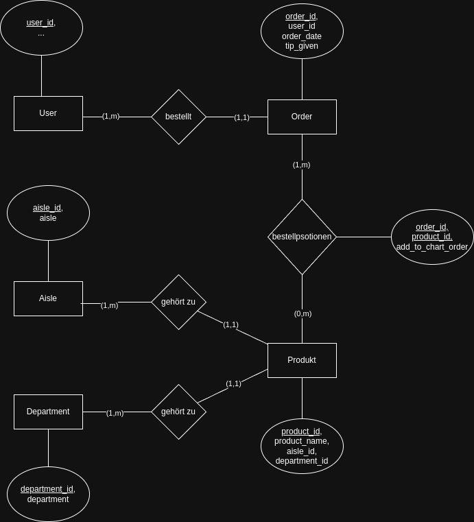
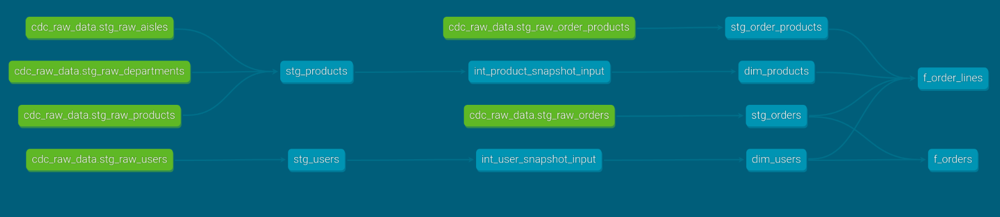
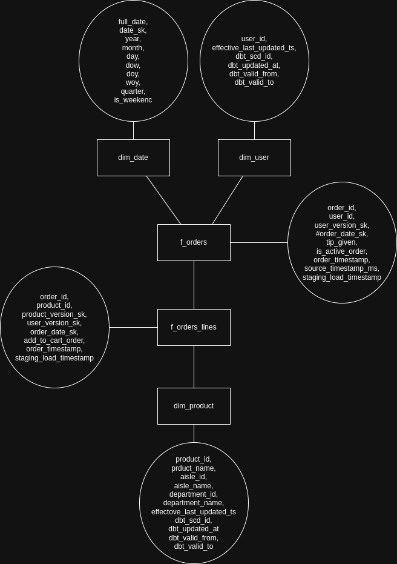

# Projekt DABI2

[](https://docs.docker.com/compose/)

Dieses Projekt implementiert eine Daten-Streaming- und Verarbeitungsplattform, die Change Data Capture (CDC) aus einer OLTP-Datenbank nutzt, Daten über Kafka streamt, in einem Data Lake (MinIO) ablegt, mit dbt und Prefect in einem DuckDB Data Warehouse transformiert und Analysen sowie Orchestrierung mit JupyterLab ermöglicht. Ein Caddy-Server fungiert als Reverse Proxy für die verschiedenen Web-UIs.

## Inhaltsverzeichnis

1.  [Überblick](#überblick)
2.  [Architektur](#architektur)
3.  [Features](#features)
4.  [Projektstruktur](#projektstruktur)
5.  [Nutzung der Services](#nutzung-der-services)
    * [Datenfluss](#datenfluss)
    * [Zugriff auf die UIs](#zugriff-auf-die-uis)
6.  [Komponenten im Detail](#komponenten-im-detail)
7.  [Tests](#tests)
8.  [Zukünftige Erweiterungen](#zukünftige-erweiterungen)
9.  [Beitragende](#beitragende)

## Überblick

Dieses Projekt dient als End-to-End-Beispiel für eine Datenplattform, die folgende Kernaufgaben abdeckt:
* **Change Data Capture (CDC):** Änderungen aus einer PostgreSQL-Datenbank (OLTP) werden in Echtzeit erfasst.
* **Streaming:** Die erfassten Änderungen werden über einen Kafka-Message-Broker gestreamt.
* **Data Lake Ingestion:** Ein Python-Consumer liest die CDC-Events von Kafka und schreibt sie als Parquet-Dateien in einen MinIO Data Lake.
* **Data Warehousing:** dbt transformiert die Rohdaten aus dem Data Lake (oder direkt aus der OLTP-Quelle via Staging/Seeds) und baut ein analytisches Data Warehouse in DuckDB auf.
* **Workflow Orchestrierung:** Prefect wird verwendet, um die verschiedenen Datenpipelines (z.B. dbt-Läufe, Consumer-Starts) zu orchestrieren und zu überwachen.
* **Analyse & Exploration:** JupyterLab bietet eine interaktive Umgebung für Datenanalyse und -exploration auf Basis des DuckDB Data Warehouse


## Architektur

### data flow
***Data Flow Chart***


### OLTP 
***ERM Diagram OLTP***


### dbt
***DBT lineage graph***


### Dwh
***Star Schema***


## Features

* **Echtzeit-CDC:** Nutzung von Debezium für PostgreSQL.
* **Skalierbares Streaming:** Apache Kafka als Message Broker.
* **Effiziente Speicherung im Data Lake:** MinIO mit Parquet-Dateiformat.
* **Modernes Data Warehousing:** DuckDB als schnelles, eingebettetes analytisches DWH.
* **Transformationslogik mit dbt:** Code-basierte, versionierbare und testbare Datenmodelle.
* **Flexible Workflow-Orchestrierung:** Prefect für die Steuerung und Überwachung von Datenpipelines.
* **Interaktive Datenanalyse:** JupyterLab für Python-basierte Analysen.
* **Benutzerfreundliche UIs:** AKHQ für Kafka-Monitoring, MinIO-Konsole, Prefect-UI, JupyterLab.
* **Zentraler Zugriff:** Caddy als Reverse Proxy.
* **Entwicklerfreundlich:** Docker-Compose-Setup mit Hot-Reloading für einige Services.
* **Makefile-Automatisierung:** Vereinfachte Befehle für Setup, Start und Stopp.

## Projektstruktur

```
.
├── Caddyfile                 # Konfiguration für den Caddy Reverse Proxy
├── data/                     # Persistente Daten (z.B. DuckDB DWH, MinIO-Daten, falls lokal gemountet)
│   └── ...
├── docker-compose.yaml       # Hauptkonfigurationsdatei für alle Docker-Services
├── init_scripts/             # Initialisierungsskripte für Datenbanken (z.B. PostgreSQL)
├── Makefile                  # Hilfsskript zum Verwalten des Stacks
├── notebooks/                # Jupyter Notebooks und zugehörige Hilfsdateien
│   ├── notebooks/
│   │   ├── aufgaben.ipynb
│   │   ├── eda.ipynb
│   │   └── utils/
│   │       └── db_conn.py
│   └── Dockerfile            # Dockerfile für den JupyterLab Service
├── src/
│   ├── consumers/            # Kafka Consumer Applikationen
│   │   └── cdc_consumer/     # Spezifischer Consumer für CDC-Events -> MinIO
│   │       └── ...           # (pyproject.toml, uv.lock, Dockerfile, src/ Code)
│   └── prefect/              # Prefect-spezifische Konfigurationen, Flows und dbt-Projekt
│       ├── config/
│       │   ├── config.py     # Python-Konfigurationen für Prefect-Flows
│       │   └── debezium-pg-connector.json # Debezium Connector Konfiguration
│       ├── dbt_setup/        # Das dbt-Projekt
│       │   ├── dbt_project.yml
│       │   ├── dev.duckdb    # Die DuckDB Datenbankdatei (Data Warehouse)
│       │   ├── models/       # dbt Modelle (SQL-Transformationen)
│       │   │   └── ...
│       │   ├── packages.yml  # dbt externe Pakete
│       │   ├── profiles.yml  # dbt Profile (Verbindung zum DWH)
│       │   ├── seeds/        # dbt Seed-Dateien (CSV-Rohdaten)
│       │   │   └── ...
│       │   ├── snapshots/    # dbt Snapshots (für SCDs)
│       │   │   └── ...
│       │   └── tests/        # dbt Tests
│       ├── Dockerfile        # Dockerfile für den Prefect Worker
│       ├── flows/            # Prefect Flow-Definitionen (Python-Skripte)
│       │   └── ...
│       ├── oltp_schema.py    # Ggf. SQLAlchemy Modelle oder Schemadefinitionen für OLTP
│       ├── run_worker.py     # Startskript für den Prefect Worker
│       ├── tasks/            # Prefect Task-Definitionen
│       │   └── ...
│       └── utils/            # Hilfsfunktionen für Prefect-Flows
│           └── ...
└── test_orders.py            # Beispiel für Tests (z.B. Integrationstests)
```

### Makefile Befehle

Das `Makefile` stellt einige Befehle zur Verfügung:

* `make`: Führt `make setup` und dann `make up`.
* `make down`: Stoppt und entfernt alle Container. Optional werden auch Volumes entfernt (siehe Makefile für Details).


## Nutzung der Services

Nachdem  `make start` oder `make up` ausgeführt wurde, laufen die folgenden Services:

### Datenfluss (vereinfacht)

1.  Änderungen in der **PostgreSQL** (`db`) OLTP-Datenbank werden von **Debezium** (im `kafka-connect`-Service) erfasst.
2.  Debezium sendet diese Änderungen als Nachrichten an **Apache Kafka** (`kafka`).
3.  Der **`cdc-lake-writer`**-Service (Python-Consumer) liest die Nachrichten von Kafka.
4.  Der Consumer verarbeitet die Nachrichten und schreibt sie als Parquet-Dateien in **MinIO** (`minio`), den Data Lake.
5.  **Prefect** (`prefect` Server und `prefect-worker`) orchestriert Workflows. Der Worker führt dbt-Tasks aus.
6.  **dbt** (innerhalb des `prefect-worker`) liest Daten aus dem Data Lake (MinIO) oder anderen Quellen, transformiert sie und baut das Data Warehouse in **DuckDB** (`dev.duckdb`, gemountet nach `./src/prefect/dbt_setup/dev.duckdb` auf dem Host).
7.  **JupyterLab** (`jupyter-lab`) kann auf das DuckDB DWH, MinIO und die OLTP-DB für Analysen zugreifen.
8.  **AKHQ** (`akhq`) bietet ein UI zur Überwachung von Kafka.
9.  **Caddy** (`caddy`) dient als Reverse Proxy für die UIs (Prefect, Jupyter, MinIO).

### Zugriff auf die UIs

Die Ports sind in `docker-compose.yaml` definiert. Wenn Caddy korrekt konfiguriert ist, sind die UIs möglicherweise unter `http://localhost:3000` über spezifische Pfade erreichbar. Ansonsten direkt über ihre Ports:

* **Prefect UI:** `http://localhost:4200` (oder `http://localhost:3000/prefect` falls von Caddy so konfiguriert)
* **JupyterLab:** `http://localhost:8888/jupyter` (Token: `dabi2` oder der in `.env` gesetzte) (oder `http://localhost:3000/jupyter` falls von Caddy so konfiguriert)
* **MinIO Konsole:** `http://localhost:9001` (Zugangsdaten aus `.env` oder `docker-compose.yaml`, z.B. `minioadmin`/`minio_secret_password`) (oder `http://localhost:3000/minio` falls von Caddy so konfiguriert)
* **AKHQ (Kafka UI):** `http://localhost:8080`
* **PostgreSQL (Datenbankzugriff):** Host `localhost`, Port `5432`, Benutzer/Passwort/DB aus `.env`.
* **DuckDB DWH:** Die Datei `dev.duckdb` befindet sich auf dem Host unter `./src/prefect/dbt_setup/dev.duckdb` und kann mit DBeaver oder anderen DuckDB-kompatiblen Tools geöffnet werden (am besten, wenn der `prefect-worker` nicht aktiv schreibt).

## Komponenten im Detail

* **`db` (PostgreSQL/TimescaleDB):** Dient als OLTP-Quelldatenbank für CDC und als Backend-Datenbank für Prefect.
* **`prefect` & `prefect-worker`:** Server und Worker für die Prefect Workflow-Orchestrierung. Der Worker führt dbt-Transformationen und andere Python-basierte Tasks aus.
* **`zookeeper` & `kafka`:** Kernkomponenten des Apache Kafka Clusters für das Event-Streaming.
* **`kafka-connect` (Debezium):** Erfasst Datenbankänderungen (CDC) und sendet sie an Kafka. Die Konfiguration des PostgreSQL-Connectors befindet sich in `src/prefect/config/debezium-pg-connector.json`.
* **`akhq`:** Web-Interface zur Verwaltung und Überwachung von Kafka.
* **`jupyter-lab`:** Interaktive Entwicklungsumgebung für Datenanalyse mit Python, Zugriff auf DuckDB, MinIO etc.
* **`minio`:** S3-kompatibler Objektspeicher, dient als Data Lake.
* **`cdc-lake-writer`:** Python-basierter Kafka-Consumer, der CDC-Events von Kafka liest und als Parquet-Dateien im MinIO Data Lake ablegt.
* **`caddy`:** Moderner, einfach konfigurierbarer Webserver und Reverse Proxy. Die Konfiguration erfolgt über die `Caddyfile`.
* **dbt (`./src/prefect/dbt_setup/`):** Projekt für Data Build Tool, das die Transformationen für das DuckDB Data Warehouse definiert.
* **DuckDB (`./src/prefect/dbt_setup/dev.duckdb`):** Die Datei, die das analytische Data Warehouse enthält.

## Tests

Die Datei `test_orders.py` deutet auf das Vorhandensein von Tests hin.
[BESCHREIBE HIER KURZ DIE TESTSTRATEGIE, WIE TESTS AUSGEFÜHRT WERDEN, UND WELCHE ARTEN VON TESTS EXISTIEREN, z.B. dbt tests, Python Unit-Tests, Integrationstests]

## Zukünftige Erweiterungen

* Implementierung von Schema Registry für Kafka
* Ausbau der dbt-Tests und Datenqualitäts-Checks
* Integration eines BI-Tools wie Lightdash oder Superset
* Monitoring-Stack mit Prometheus/Grafana
* CI/CD-Pipeline für automatisierte Builds und Deployments

## Beitragende

[PLATZHALTER: Liste hier Personen auf, die zum Projekt beigetragen haben, oder beschreibe, wie andere beitragen können.]


#### get tree structure of important files in project:

```sh
tree -I '.venv|deliverables|__init__.py|.git*|__pycache__|.ipynb_checkpoints|*.pyc|*.lock|.sql*'
```

#### change permissions for duckdb file when dbeaver cant connect to it
```sh
sudo chown $(id -u):$(id -g) ~/path/to/dev.duckdb
```

#### remove docker stuff
```sh
docker system prune -a -f --volumes
```

#### TODO:
- reduce logs in general and create prefect artifacts wherever its useful
- work on comments, just leave the important 
- refactor flows
- refactor run_worker
- refactor confog setting flow: control every constant with prefect/config/setting.py and a .env file
- add tests to dbt runs
- create data marts for use-case


#### Fragen Zwischentermin
1. brauchen Faktentabellen auch surrogate keys? (Also benötigt eine bestellung einen surrogate key) gerade ist in f_order_lines die order_id drin und kein sk (theoretisch könnten sich einträge für bestellungen ändern?)
2. in fakten tabellen nur surrogate keys verwenden oder auch die ids?